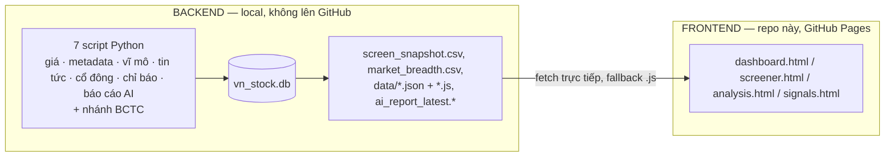
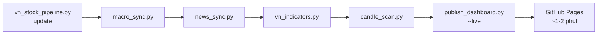

# VNSTOCK — Vietnamese Stock Market Dashboard

<p>
  
  
  
  
</p>

> Dashboard chứng khoán Việt Nam kiểu TradingView, dữ liệu tổng hợp từ pipeline Python chạy
> local (7 chân kiềng: giá, metadata, vĩ mô, tin tức, cổ đông, chỉ báo kỹ thuật, báo cáo AI)
> + nhánh báo cáo tài chính quý (BCTC). Repo này là **website tĩnh + tài liệu công khai**;
> pipeline dữ liệu chạy trên máy local, không nằm trong repo — xem [vì sao](docs/ARCHITECTURE.md).

**Live dashboard:** [tungthanhnguyen2312-wq.github.io/market-dashboard](https://tungthanhnguyen2312-wq.github.io/market-dashboard/) · **Repo:** `tungthanhnguyen2312-wq/market-dashboard`

---

## 🇬🇧 English Summary

**Overview** — A personal Vietnamese stock-market analytics project. A local Python pipeline
(not included in this repo) collects daily OHLCV prices, fundamentals, macro data, news, and
quarterly financial statements for ~1,700 tickers, then mixes them into a static dashboard
published here via GitHub Pages. This repository holds the **public site + documentation
only** — the scraping/analysis code and the underlying database are personal data assets kept
local (see [docs/ARCHITECTURE.md](docs/ARCHITECTURE.md) for the full split and reasoning).

**Main Features**
- TradingView-style dashboard: AI-generated market report, KPIs, watchlist, full market table.
- Multi-timeframe candlestick/SMC signal board (`signals.html`, daily/weekly/monthly only) and a full screener with CANSLIM/SMC filters (`screener.html`).
- Offline quant engine (10 strategies, 0-100 scoring) and a quarterly financial-report pipeline — both documented in `docs/`, code kept local.
- No build step: static HTML/CSS/JS, libraries loaded from CDN, works opened directly as a file or served over GitHub Pages.

**Quick Start** — This repo is browsable/forkable as-is (open `dashboard.html` or visit the live
link above — `index.html` simply redirects there to preserve the original GitHub Pages URL). To
run the underlying data pipeline yourself, you'll need the Python scripts
described in [docs/CLI_REFERENCE.md](docs/CLI_REFERENCE.md) — they are not distributed in this
repo (see the architecture doc for why). Full Vietnamese instructions continue below.

---

## Tổng quan

Hệ thống gồm 2 nửa — chi tiết đầy đủ + sơ đồ luồng dữ liệu: **[docs/ARCHITECTURE.md](docs/ARCHITECTURE.md)**.

- **Backend (local, không public)** — 7 chân kiềng quanh kho `vn_stock.db` (~1.686 mã,
  ~1,9 triệu dòng giá + metadata + macro + news + cổ đông) + nhánh BCTC (báo cáo tài chính quý).
- **Frontend (GitHub Pages, chính là repo này)** — terminal tĩnh (sidebar + top bar), không cần build:
  - `dashboard.html` — trang chính: báo cáo AI + KPI + watchlist + bảng thị trường (`index.html` chỉ redirect sang đây để giữ URL gốc).
  - `screener.html` — bảng lọc đầy đủ (CANSLIM, SMC, thanh khoản...).
  - `analysis.html` — Quant Engine offline (10 chiến lược, chấm điểm 0-100).
  - `signals.html` — tín hiệu nến / Smart Money Concept theo phiên.
  - `macro.html`, `about.html`, `archive.html` — dashboard vĩ mô từ pipeline, giới thiệu dự án, kho lưu trữ báo cáo tĩnh.

**Kiến trúc:**



**Luồng vận hành hằng ngày** (chi tiết đầy đủ: [docs/CLI_REFERENCE.md](docs/CLI_REFERENCE.md)):



> *Dữ liệu sinh tự động, chỉ mang tính tham khảo — **không phải khuyến nghị đầu tư**.*

## Tính năng chính

- **Dashboard chính** — báo cáo thị trường do AI tổng hợp (regime BULL/NEUTRAL/BEAR, breadth, watchlist, kế hoạch hành động), 5 KPI card, 2 biểu đồ Chart.js, lối tắt tới kho lưu trữ báo cáo cũ ([archive.html](archive.html)).
- **Bảng tín hiệu nến/SMC** (`signals.html`) — tab mẫu hình quét lịch sử 31 mẫu trên đúng 3 khung `1D/1W/1M`, có `forming/completed`, điểm 0–100, xác nhận/cảnh báo và fallback `file://`; không hỗ trợ hoặc nội suy intraday. **Bảng lọc đầy đủ** (`screener.html`) giữ nguyên CANSLIM/SMC.
- **Dashboard vĩ mô** (`macro.html`) — lãi suất, tỷ giá, CPI/GDP đúng kỳ dữ liệu, DXY, dầu, vàng, VIX; đọc JSON khi chạy HTTP/GitHub Pages và fallback JS khi mở trực tiếp.
- **Quant engine offline** (`stock_analyzer.py`, chạy local) — 10 chiến lược lọc + chấm điểm 0-100/mã, xem [docs/STOCK_ANALYZER.md](docs/STOCK_ANALYZER.md).
- **Nhánh báo cáo tài chính quý (BCTC)** — chuẩn hóa BCĐKT/KQKD/LCTT cho ~650 mã, xem [docs/FINANCIAL_REPORT.md](docs/FINANCIAL_REPORT.md).
- **Dark mode chuyên nghiệp**, responsive, không cần build/cài đặt — thư viện load qua CDN.

## Dashboard Preview

*(Coming soon — chưa có ảnh chụp màn hình chính thức. Xem trực tiếp tại [live site](https://tungthanhnguyen2312-wq.github.io/market-dashboard/) trong lúc chờ.)*

## Quick Start

Muốn **chỉ xem dashboard**: mở [live site](https://tungthanhnguyen2312-wq.github.io/market-dashboard/)
hoặc mở thẳng `dashboard.html` (chạy được cả khi mở file trực tiếp, có fallback; `index.html` chỉ
redirect sang `dashboard.html` để giữ URL gốc).

Muốn **chạy pipeline dữ liệu** (cần code Python không nằm trong repo này — xem
[docs/ARCHITECTURE.md](docs/ARCHITECTURE.md) để hiểu vì sao): cài dependency bằng
[requirements.txt](requirements.txt) rồi theo hướng dẫn setup lần đầu ở
**[docs/USER_GUIDE.md](docs/USER_GUIDE.md)**, toàn bộ lệnh hằng ngày/tuần/tháng ở
**[docs/CLI_REFERENCE.md](docs/CLI_REFERENCE.md)**.

```powershell
# Xem thử dashboard ở local (không cần cài gì ngoài Python có sẵn)
# Cổng 8017 khớp với .claude/launch.json — dùng cổng nào cũng được, chỉ cần khớp khi mở trình duyệt
python -m http.server 8017
# rồi mở http://localhost:8017/dashboard.html

# Cài dependency cho pipeline dữ liệu (chỉ cần nếu tự chạy pipeline, không cần để xem dashboard)
pip install -r requirements.txt
```

## Cấu trúc Repository

```
VNSTOCK/
├── index.html                                # redirect → dashboard.html (giữ URL gốc GitHub Pages)
├── dashboard.html, screener.html, signals.html, analysis.html   # 4 trang dữ liệu chính (public)
├── macro.html, about.html, archive.html      # dashboard vĩ mô, giới thiệu, kho lưu trữ (public)
├── assets/css/, assets/js/                   # khung sườn Tailwind (sidebar/top bar/footer) (public)
├── app.js, analysis.js, style.css            # logic tải dữ liệu + design system — KHÔNG đổi (public)
├── nav.css                                   # chỉ còn dùng bởi báo cáo lịch sử tĩnh (playbook-*/report-*) (public)
├── data/                                     # tín hiệu/screener/heatmap/mẫu nến + macro snapshot JSON/JS (public)
├── docs/                                     # tài liệu (public — trừ 2 file audit nội bộ bên dưới)
│   ├── USER_GUIDE.md          # setup lần đầu, lỗi thường gặp
│   ├── ARCHITECTURE.md        # kiến trúc, luồng dữ liệu, quy ước UI
│   ├── CLI_REFERENCE.md       # toàn bộ lệnh + lịch chạy
│   ├── DATA_PIPELINE.md       # các tầng dữ liệu + bẫy dữ liệu/vận hành
│   ├── FINANCIAL_REPORT.md    # nhánh BCTC
│   ├── STOCK_ANALYZER.md      # quant engine offline + thư viện chỉ báo
│   ├── REPO_AUDIT.md          # audit dọn repo (phase này)
│   ├── RELEASE_CHECKLIST.md   # checklist release
│   ├── AUDIT_REPORT.md        # (nội bộ, gitignore) audit API/công thức BCTC
│   └── VALIDATION_REPORT.md   # (nội bộ, gitignore) kiểm thử snapshot BCTC
├── tests/                                    # test hồi quy cho stock_analyzer.py (public)
├── screen_snapshot.csv, market_breadth.csv   # snapshot dữ liệu cho web (public)
├── ai_report_latest.md/.json                 # báo cáo AI mới nhất (public, bản copy)
├── playbook-*.html, report-*.html            # báo cáo tĩnh lưu trữ — liệt kê tại archive.html (public)
├── CHANGELOG.md, CHANGELOG_UI.md             # lịch sử phát triển (public)
├── requirements.txt                          # dependency cho pipeline local (public)
│
├── *.py                                      # 12 script pipeline/phân tích — LOCAL, gitignore
├── vn_stock.db, ohlcv_flat.*, data_bctc/      # kho dữ liệu gốc — LOCAL, gitignore
└── NOTES_FOR_TUNG*.md                        # ghi chú cá nhân — LOCAL, gitignore
```

## Tài liệu

| Tài liệu | Nội dung |
|---|---|
| [docs/USER_GUIDE.md](docs/USER_GUIDE.md) | Setup lần đầu, lỗi PowerShell thường gặp, thuật ngữ báo cáo AI |
| [docs/ARCHITECTURE.md](docs/ARCHITECTURE.md) | Kiến trúc tổng thể, sơ đồ luồng dữ liệu, tầng dữ liệu, quy ước UI |
| [docs/CLI_REFERENCE.md](docs/CLI_REFERENCE.md) | Toàn bộ lệnh chạy, lịch trình hằng ngày/tuần/tháng/quý, đẩy web |
| [docs/DATA_PIPELINE.md](docs/DATA_PIPELINE.md) | Chi phí `ai_analyzer.py`, gửi dữ liệu cho AI, mở dữ liệu trong Excel, các bẫy dữ liệu |
| [docs/FINANCIAL_REPORT.md](docs/FINANCIAL_REPORT.md) | Nhánh báo cáo tài chính quý (BCTC) |
| [docs/STOCK_ANALYZER.md](docs/STOCK_ANALYZER.md) | Quant engine offline + thư viện chỉ báo kỹ thuật |
| [CHANGELOG.md](CHANGELOG.md) | Lịch sử phát triển + roadmap |
| [CONTRIBUTING.md](CONTRIBUTING.md) | Phạm vi đóng góp (chỉ frontend + tài liệu) |
| [SECURITY.md](SECURITY.md) | Báo lỗi bảo mật |

## Roadmap

Xem [CHANGELOG.md](CHANGELOG.md) mục "Future Roadmap" — các hạng mục đang cân nhắc: backtester
dựa trên `watchlist_history`, cột tùy chọn cho screener, lưu bộ lọc vào localStorage, PWA nhẹ cho
dashboard, mở rộng panel chi tiết mã (`company-panel.js`) sang các bảng khác ngoài `screener.html`.

## Giấy phép & Cảnh báo

Phát hành theo giấy phép [MIT](LICENSE) — **áp dụng cho mã nguồn trong repo này** (dashboard
tĩnh + tài liệu). Dữ liệu thị trường được lấy về qua thư viện [`vnstock`](https://vnstocks.com/)
và tuân theo giấy phép/điều khoản sử dụng riêng của `vnstock` (không phải MIT) — xem
[docs/DATA_PIPELINE.md](docs/DATA_PIPELINE.md) để biết dữ liệu nào lấy từ đâu.

> ⚠️ Dữ liệu và báo cáo trong dashboard này **sinh tự động, chỉ mang tính tham khảo** — hoàn
> toàn **không phải khuyến nghị đầu tư**. Tự chịu trách nhiệm với quyết định đầu tư của mình.

## Đóng góp & Hỗ trợ

Đóng góp cho phần frontend/tài liệu — xem [CONTRIBUTING.md](CONTRIBUTING.md) để biết phạm vi
(pipeline dữ liệu không nằm trong repo này nên không nhận PR cho phần đó). Báo lỗi bảo mật:
xem [SECURITY.md](SECURITY.md). Quy tắc ứng xử: [CODE_OF_CONDUCT.md](CODE_OF_CONDUCT.md).
