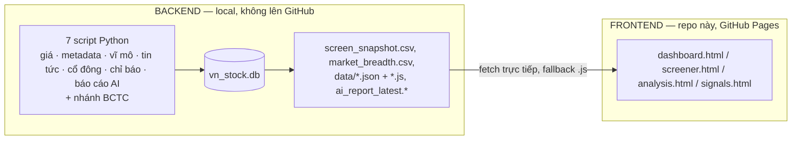

# Stock Look Up

<p>
  
  
  
</p>

> **Personal Vietnamese Stock Market Intelligence System.** Dashboard chứng khoán Việt Nam kiểu TradingView, dữ liệu tổng hợp từ pipeline Python chạy
> local (7 chân kiềng: giá, metadata, vĩ mô, tin tức, cổ đông, chỉ báo kỹ thuật, báo cáo AI)
> + nhánh báo cáo tài chính quý (BCTC). Repo này là **website tĩnh + tài liệu công khai**;
> pipeline dữ liệu chạy trên máy local, không nằm trong repo.

**Live dashboard:** [tungthanhnguyen2312-wq.github.io/market-dashboard](https://tungthanhnguyen2312-wq.github.io/market-dashboard/) · **Repo:** `tungthanhnguyen2312-wq/market-dashboard`

---

## 📄 Hướng dẫn vận hành đầy đủ (local)

> **Toàn bộ hướng dẫn chạy pipeline, bản đồ file dữ liệu, và bộ file nên gửi AI** đã được gộp
> vào một tài liệu duy nhất bên ngoài repo:
>
> **`../VNSTOCK_GUIDE.md`** (đường dẫn tuyệt đối: `C:\Projects\VNSTOCK_GUIDE.md`)
>
> Tài liệu đó ghi rõ: từng lệnh Python/CLI (chạy từ đâu, tham số, file vào/ra), bảng vị trí mọi
> file được sinh ra (CSV/JSON/Parquet/SQLite), và danh sách file nên gửi ChatGPT, Codex hoặc Claude.

---

## 🇬🇧 English Summary

A personal, independent Vietnamese stock-market intelligence project: a local Python pipeline (not in this repo)
collects daily OHLCV, fundamentals, macro data, news and quarterly financial statements for
~1,700 tickers, then mixes them into the static TradingView-style dashboard published here via
GitHub Pages. This repository holds the **public site + documentation only** — the
scraping/analysis code and the underlying database are personal data assets kept local.
The full operating manual (commands, data-file map, AI-upload set) lives in the local
`../VNSTOCK_GUIDE.md`.

---

## Tổng quan

Hệ thống gồm 2 nửa:

- **Backend (local, không public)** — 7 chân kiềng quanh kho `vn_stock.db` (~1.686 mã,
  ~1,9 triệu dòng giá + metadata + macro + news + cổ đông) + nhánh BCTC (báo cáo tài chính quý).
- **Frontend (GitHub Pages, chính là repo này)** — terminal tĩnh (sidebar + top bar), không cần build:
  - `dashboard.html` — trang chính: báo cáo AI + KPI + watchlist + bảng thị trường (`index.html` chỉ redirect sang đây).
  - `screener.html` — bảng lọc đầy đủ (CANSLIM, SMC, thanh khoản...).
  - `analysis.html` — Quant Engine offline (10 chiến lược, chấm điểm 0-100).
  - `signals.html` — tín hiệu nến / Smart Money Concept theo phiên.
  - `macro.html`, `about.html`, `archive.html` — dashboard vĩ mô, giới thiệu, kho lưu trữ báo cáo tĩnh.

**Kiến trúc:**



**Luồng vận hành hằng ngày:** `vn_stock_pipeline.py update` → `macro_sync.py` → `news_sync.py`
→ `vn_indicators.py` → `candle_scan.py` → `publish_dashboard.py --live`. Chi tiết lệnh + lịch
chạy tuần/tháng/quý: xem **`../VNSTOCK_GUIDE.md`**.

> *Dữ liệu sinh tự động, chỉ mang tính tham khảo — **không phải khuyến nghị đầu tư**.*

## Quick Start

Muốn **chỉ xem dashboard**: mở [live site](https://tungthanhnguyen2312-wq.github.io/market-dashboard/)
hoặc mở thẳng `dashboard.html` (chạy được cả khi mở file trực tiếp, có fallback).

Muốn **chạy pipeline dữ liệu** (cần code Python không nằm trong repo này): cài dependency bằng
[requirements.txt](requirements.txt) rồi làm theo **`../VNSTOCK_GUIDE.md`** (setup + toàn bộ lệnh).

```powershell
# Xem thử dashboard ở local (cổng 8017 khớp với .claude/launch.json)
python -m http.server 8017
# rồi mở http://localhost:8017/dashboard.html

# Cài dependency cho pipeline dữ liệu (chỉ cần nếu tự chạy pipeline)
pip install -r requirements.txt
```

Đẩy web lên GitHub Pages: `sync_and_publish.bat` (mặc định dry-run; publish thật: `sync_and_publish.bat --live`).

## Tài liệu

| Tài liệu | Nội dung |
|---|---|
| **`../VNSTOCK_GUIDE.md`** (local) | **Hướng dẫn vận hành đầy đủ**: mọi lệnh chạy, bản đồ file dữ liệu, bộ file gửi AI |
| [CHANGELOG.md](CHANGELOG.md) | Lịch sử phát triển + roadmap |
| [CHANGELOG_UI.md](CHANGELOG_UI.md) | Lịch sử refactor giao diện |
| [CONTRIBUTING.md](CONTRIBUTING.md) | Phạm vi đóng góp (chỉ frontend + tài liệu) |
| [SECURITY.md](SECURITY.md) | Báo lỗi bảo mật |
| [docs/PROJECT_DIRECTION.md](docs/PROJECT_DIRECTION.md) | Định hướng, ranh giới và roadmap của dự án |
| [docs/THIRD_PARTY_AND_LICENSE.md](docs/THIRD_PARTY_AND_LICENSE.md) | Attribution, giấy phép và điều khoản dữ liệu bên thứ ba |
| [docs/DOCUMENTATION_INVENTORY.md](docs/DOCUMENTATION_INVENTORY.md) | Danh mục, phân loại và đề xuất vệ sinh tài liệu |
| `docs/` | Tài liệu tham chiếu kỹ thuật (data dictionary, financial mapping, schema guards, …) |

## Bản quyền & Cảnh báo

Stock Look Up là dự án cá nhân độc lập, không phải sản phẩm chính thức của vnstock và không liên kết, được tài trợ hoặc xác nhận bởi tác giả hay đội ngũ vnstock.

Copyright © 2026 Nguyễn Thành Tùng. Giấy phép [MIT License](LICENSE) chỉ áp dụng cho phần mã nguồn do Stock Look Up sở hữu và phát hành trong repository này.

Các thư viện bên thứ ba (bao gồm `vnstock`) tiếp tục chịu giấy phép riêng. Dữ liệu thị trường, hồ sơ doanh nghiệp và dữ liệu từ các nhà cung cấp tiếp tục chịu điều khoản của từng nguồn. MIT License của repository này không cấp quyền phân phối lại mã hoặc dữ liệu bên thứ ba. Việc dùng `vnstock` hiện dành cho mục đích cá nhân, nghiên cứu và phi thương mại; trước khi thương mại hóa, cần kiểm tra hoặc xin phép riêng với vnstock và từng nguồn dữ liệu liên quan. Xem [attribution chi tiết](docs/THIRD_PARTY_AND_LICENSE.md).

> Dữ liệu và báo cáo trong dashboard được sinh tự động, chỉ mang tính tham khảo,
> không phải khuyến nghị đầu tư.

## Đóng góp & Hỗ trợ

Đóng góp cho phần frontend/tài liệu — xem [CONTRIBUTING.md](CONTRIBUTING.md) để biết phạm vi
(pipeline dữ liệu không nằm trong repo này nên không nhận PR cho phần đó). Báo lỗi bảo mật:
xem [SECURITY.md](SECURITY.md). Quy tắc ứng xử: [CODE_OF_CONDUCT.md](CODE_OF_CONDUCT.md).
